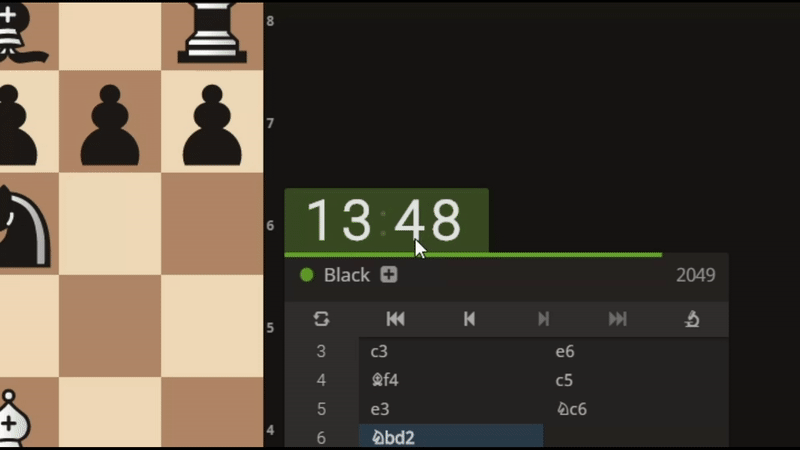
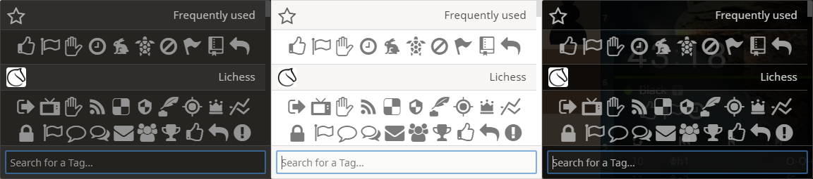
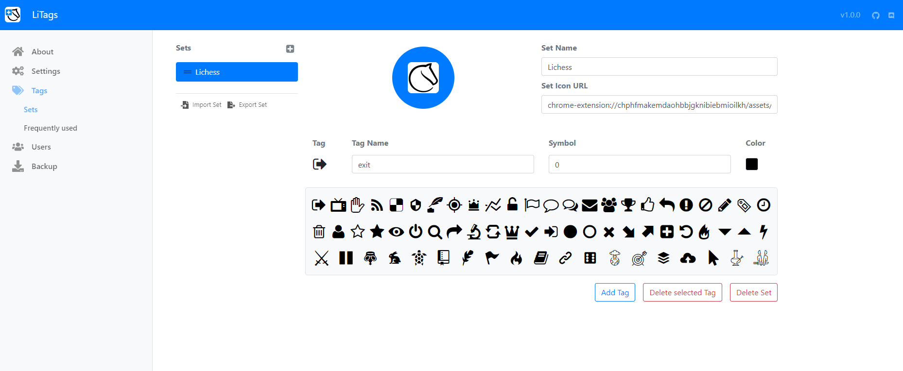

# LiTags

LiTags (li[chess] tags) is a browser extension which enables you to assign tags
to players on [lichess.org](https://www.lichess.org). The idea was being able to quickly determine the
type of player you face (playing for time, defensive, aggressive, gives no rematches, ...).

## LiTags works with all Lichess Themes

## LiTags Options

LiTags is written in [Typescript](https://www.typescriptlang.org/), uses [Webpack](https://webpack.js.org/) for module
bundling, relies on [React](https://reactjs.org/) for its user interfaces in combination with
[Redux](https://redux.js.org/) for state management including the additional [React-Redux](https://react-redux.js.org/)
bindings. CSS is generated with [Sass](https://sass-lang.com/) making use of [Bootstrap](https://getbootstrap.com/) in
combination with [React Bootstrap](https://react-bootstrap.github.io/). Sorting tags in a list was implemented with
[React Sortable HOC](https://github.com/clauderic/react-sortable-hoc).

## Building and contributing

See [CONTRIBUTING.md](/CONTRIBUTING.md).

## License

See [LICENSE](/LICENSE).

## Attributions

Files | Author(s) | Licence
---|---|---
assets/fonts/lichess.woff2 | [ornicar/lila](https://github.com/ornicar/lila/blob/master/public/font/lichess.woff2) | [OFL](http://scripts.sil.org/cms/scripts/page.php?site_id=nrsi&id=OFL), [MIT](https://github.com/primer/octicons/blob/master/LICENSE), [CC BY 4.0](https://creativecommons.org/licenses/by/4.0/), AGPLv3+
assets/images/*.svg | [fontawesome](https://fontawesome.com/) | [OFL](http://scripts.sil.org/cms/scripts/page.php?site_id=nrsi&id=OFL), [MIT](https://github.com/primer/octicons/blob/master/LICENSE), [CC BY 4.0](https://creativecommons.org/licenses/by/4.0/)
